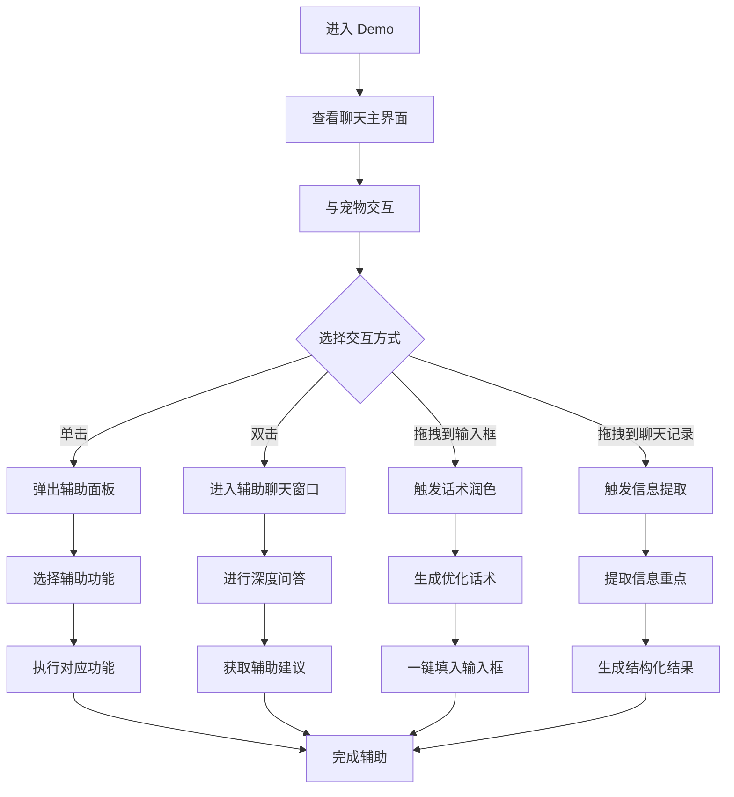

## 1. 产品概述
QQ 小宠物 AI 助手是一个以 QQ 小宠物为交互载体的全场景聊天辅助智能体，为用户提供实时、便捷的聊天辅助功能。
- 解决用户在聊天过程中遇到的话术润色、信息提取、回复生成等问题，提升沟通效率和质量。
- 目标用户为 QQ 日常用户，包括学生、职场人士、普通社交用户等。

## 2. 核心功能

### 2.1 用户角色
| 角色 | 注册方式 | 核心权限 |
|------|----------|----------|
| 普通用户 | 无需注册 | 使用所有聊天辅助功能 |

### 2.2 功能模块
1. **聊天主界面**：聊天窗口、输入框、QQ 小宠物
2. **宠物交互系统**：宠物动作、拖拽、点击、长按等交互
3. **聊天辅助功能**：话术润色、信息提取、回复生成、场景模板
4. **辅助聊天窗口**：深度问答、长文本辅助

### 2.3 页面详情
| 页面名称 | 模块名称 | 功能描述 |
|----------|----------|----------|
| 聊天主界面 | 聊天窗口 | 展示聊天记录，支持消息发送和接收 |
| 聊天主界面 | 输入框 | 输入消息，支持宠物拖拽投放触发辅助 |
| 聊天主界面 | QQ 小宠物 | 全局悬浮，支持点击、双击、拖拽等交互，触发辅助功能 |
| 聊天主界面 | 快捷辅助面板 | 单击宠物弹出，提供话术润色、生成回复、提取重点等功能 |
| 辅助聊天窗口 | 聊天界面 | 与宠物进行深度问答，提供长文本辅助 |

## 3. 核心流程
用户打开 Demo 后，可通过与 QQ 小宠物的交互触发各种聊天辅助功能：
1. 拖拽宠物到输入框 → 触发话术润色
2. 拖拽宠物到聊天记录 → 触发信息提取
3. 单击宠物 → 弹出辅助面板
4. 双击宠物 → 进入辅助聊天窗口
5. 输入关键词 → 宠物弹出建议气泡

## 4. 用户界面设计
### 4.1 设计风格
- 主色调：QQ 品牌蓝 #0084FF
- 辅助色：浅灰背景 #F5F6F7、白色聊天面板 #FFFFFF、暖橙色 #FF7D00（辅助气泡）
- 按钮风格：圆角 8px，与 QQ 原生气泡一致
- 字体：桌面端 14px，移动端 16px
- 布局风格：响应式布局，桌面端三栏，移动端单栏
- 图标风格：QQ 原生风格，简洁明了

### 4.2 页面设计概览
| 页面名称 | 模块名称 | UI 元素 |
|----------|----------|----------|
| 聊天主界面 | 聊天窗口 | 消息气泡（用户居右绿色，对方居左白色），滚动条，时间戳 |
| 聊天主界面 | 输入框 | 文本输入区域，发送按钮，表情按钮 |
| 聊天主界面 | QQ 小宠物 | 80px*80px（桌面端）/ 60px*60px（移动端），支持拖拽，有闲置动画 |
| 聊天主界面 | 快捷辅助面板 | 紧贴宠物位置弹出，包含话术润色、生成回复、提取重点、场景模板、辅助设置选项 |
| 辅助聊天窗口 | 聊天界面 | 类似 QQ 聊天窗口，宠物为对话主体，支持多轮对话 |

### 4.3 响应式设计
- 桌面端（≥1024px）：三栏固定布局，宠物全局悬浮
- 平板（768px-1023px）：两栏自适应布局，宠物固定在右下角
- 移动端（<768px）：单栏全屏布局，底部固定 Tab 导航，宠物固定在右下角

### 4.4 动画效果
- 宠物闲置动画：眨眼、呼吸、晃脑袋、摇尾巴等
- 交互动画：点击时抬爪、点头，双击时蹦跳、转圈，拖拽时蜷缩跟随
- 面板弹出动画：流畅的滑入效果，时长 0.2s-0.3s
- 加载动画：话术生成、信息提取时有清晰的加载状态