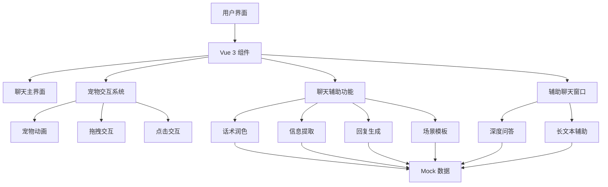

## 1. 架构设计


## 2. 技术描述
- 前端：Vue 3 + TypeScript + Vite + Tailwind CSS
- 初始化工具：vite-init
- 后端：无（纯前端 Mock 实现）
- 数据库：无（使用 Mock 数据）

## 3. 路由定义
| 路由 | 用途 |
|------|------|
| / | 聊天主界面 |
| /pet-chat | 辅助聊天窗口 |

## 4. 项目结构
```
/src
  /assets            # 静态资源
    /images          # 宠物图片
    /styles          # 全局样式
  /components        # 组件
    /chat            # 聊天相关组件
      ChatWindow.vue     # 聊天窗口
      InputBox.vue       # 输入框
      MessageBubble.vue  # 消息气泡
    /pet             # 宠物相关组件
      QQPet.vue          # QQ 小宠物
      PetAnimation.vue   # 宠物动画
    /assistant       # 辅助功能组件
      AssistantPanel.vue    # 快捷辅助面板
     润色Panel.vue         # 话术润色面板
      ExtractPanel.vue      # 信息提取面板
      TemplatePanel.vue     # 场景模板面板
  /views             # 页面
    ChatView.vue     # 聊天主界面
    PetChatView.vue  # 辅助聊天窗口
  /composables       # 可复用逻辑
    usePetInteraction.ts   # 宠物交互逻辑
    useChatAssistant.ts    # 聊天辅助逻辑
  /utils             # 工具函数
    mockData.ts      # Mock 数据
    animation.ts     # 动画工具
  /router            # 路由配置
    index.ts
  App.vue            # 根组件
  main.ts            # 入口文件
```

## 5. 核心组件设计
### 5.1 QQPet 组件
- 功能：全局悬浮，支持点击、双击、拖拽等交互
- 属性：
  - position: { x: number, y: number } - 宠物位置
  - size: number - 宠物大小
  - isDragging: boolean - 是否正在拖拽
- 方法：
  - startDrag() - 开始拖拽
  - endDrag() - 结束拖拽
  - handleClick() - 处理点击事件
  - handleDoubleClick() - 处理双击事件
  - updateAnimation() - 更新动画状态

### 5.2 ChatWindow 组件
- 功能：展示聊天记录，支持消息发送和接收
- 属性：
  - messages: Array - 消息列表
  - selectedText: string - 选中的文本
- 方法：
  - sendMessage() - 发送消息
  - selectText() - 选择文本

### 5.3 InputBox 组件
- 功能：输入消息，支持宠物拖拽投放触发辅助
- 属性：
  - value: string - 输入内容
  - placeholder: string - 占位符
- 方法：
  - handleInput() - 处理输入事件
  - handleSend() - 处理发送事件
  - handleDrop() - 处理宠物投放事件

### 5.4 AssistantPanel 组件
- 功能：快捷辅助面板，提供各种聊天辅助功能
- 属性：
  - position: { x: number, y: number } - 面板位置
  - isVisible: boolean - 是否可见
- 方法：
  - show() - 显示面板
  - hide() - 隐藏面板
  - handleOptionClick() - 处理选项点击

## 6. 核心逻辑设计
### 6.1 宠物交互逻辑
- 拖拽功能：使用鼠标/触摸事件实现宠物的拖拽和投放
- 点击事件：单击弹出辅助面板，双击进入辅助聊天窗口
- 动画系统：根据交互状态和聊天场景切换宠物动画

### 6.2 聊天辅助逻辑
- 话术润色：基于输入内容生成不同风格的优化话术
- 信息提取：从选中的聊天记录中提取结构化信息
- 回复生成：基于聊天上下文生成适配的回复
- 场景模板：提供各种聊天场景的话术模板

### 6.3 响应式设计逻辑
- 使用 Tailwind CSS 的响应式类实现不同屏幕尺寸的布局适配
- 宠物位置和大小根据屏幕尺寸自动调整
- 面板弹出位置根据设备类型优化

## 7. Mock 数据设计
- 预设聊天记录：包含不同场景的聊天内容
- 预设话术模板：覆盖学生、职场、日常社交等场景
- 预设润色结果：模拟不同风格的优化话术
- 预设信息提取结果：模拟结构化的信息提取结果

## 8. 性能优化
- 组件懒加载：使用 Vue 的异步组件减少初始加载时间
- 动画优化：使用 CSS 动画和 transform 属性，避免重排
- 事件防抖：对输入事件和拖拽事件进行防抖处理
- 状态管理：使用 Vue 的响应式系统，避免不必要的渲染